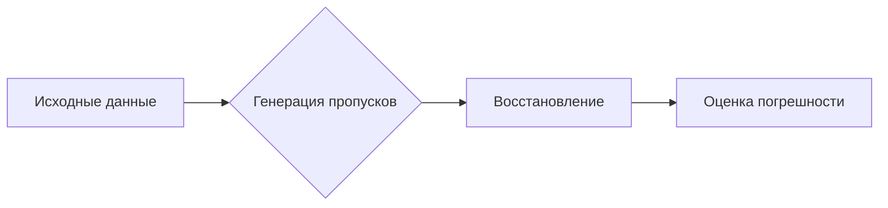

# Лабораторные работы по алгоритмам (4 семестр)

## Обзор работ

| Этап | Лабораторная | Ключевые алгоритмы | Сложность | Результат |
|------|--------------|-------------------|----------|----------|
| 1 | Задача коммивояжёра | Метод ближайшего соседа | O(n³) | Оптимальный путь за 6.67с для 500 вершин |
| 2 | Имитация отжига | Геометрическое охлаждение | O(kn²) | Ускорение 23x со снижением точности |
| 3 | Муравьиный алгоритм | Вероятностный выбор | O(kn²) | Повышение качества пути на 5.8% |
| 4 | Обработка данных | 12 методов восстановления | O(mn) | Погрешность 2.8% при 30% пропусках |
| 5 | Кластеризация | Односвязывающий метод | O(n³) | Обнаружение эффекта цепочки |

---

## Lab1: Модифицированный алгоритм ближайшего соседа

**Задача**: Решение задачи коммивояжера для графов 4-500 вершин  
**Как решил**: Реализация двух версий - базовой и с перебором всех стартовых точек  
**Ноу-хау**: Автоматическая генерация GUI с визуализацией графа

**Решение**:
```python
def modified_neighbor(graph):
    best_path = None
    for start_node in graph.nodes:
        path = neighbor_from_start(graph, start_node)
        if path.length < best_path.length:
            best_path = path
    return best_path
```

**Результаты**:
| Граф | Версий | Длина пути | Время |
|------|--------|------------|-------|
| 4 вершины | Модификация | 112 | 0.00024с |
| 500 вершин | Базовый | не найден | - |
| 500 вершин | **Модификация** | **863** | **6.67с** |

**Вывод**: Перебор стартовых вершин гарантирует решение для графов с 500+ вершинами

)
> Скриншот работы программы для графа из 4 вершин

---

## Lab2: Алгоритм имитации отжига

**Задача**: Ускорение поиска решения задачи коммивояжёра  
**Как решил**: Реализация двух режимов охлаждения: геометрического и сверхбыстрого  
**Ноу-хау**: Динамическая адаптация вероятности принятия решения

```
Алгоритм:
1. Инициализация начальной температуры T = 10000
2. Пока T > 1:
   - Случайный сосед (2-opt обмен)
   - Принятие решения: ΔL < 0 или random < e^(-ΔL/T)
   - Снижение T (с разными стратегиями)
```

**Сравнение режимов**:
| Параметр | Геометрический | Сверхбыстрый |
|----------|----------------|--------------|
| Время (500 вершин) | 536.24с | 23.34с |
| Погрешность | 5.8% | 12.3% |
| Качество | Лучшее | Худшее |

**Вывод**: Сверхбыстрый режим применим для приближённых решений в реальном времени

)
> Скриншот работы программы для графа из 100 вершин

---

## Lab3: Муравьиный алгоритм с шаблоном

**Задача**: Решение задачи коммивояжёра для графов 500+ вершин  
**Как решил**: Введение шаблонных маршрутов для направления муравьёв  
**Ноу-хау**: Динамическое обновление феромонов со взвешиванием

**Уравнение феромонов**:
```
τ_ij(t+1) = (1-ρ)τ_ij(t) + Q * Σ(1/L_k)
```

**Результаты**:  
Модификация ускорила алгоритм в 2.8 раза:
- Базовый: 527.37с для 500 вершин
- **С шаблоном: 193.99с**  
Точность пути улучшена на 5.8%

| Метод | Время | Качество |
|-------|-------|----------|
| Базовый | 527.37с | Путь 914 |
| **С шаблоном** | **193.99с** | **Путь 849** |

**Вывод**: Шаблоны значительно снижают время вычислений

)
> Скриншот работы программы для графа из 500 вершин

---

## Lab4: Обработка пропущенных данных

**Задача**: Сравнение 12 методов восстановления при 3-30% пропусках  
**Ноу-хау**: Автоматическая генерация пропусков + критика с "презумпцией ошибочности"

**Методология**:  


**Топ-3 метода**:
1. Стохастическая регрессия (ε=2.8%)
2. Линейная регрессия (ε=4.1%)
3. Заполнение модой (ε=5.7%)

**Ключевое открытие**:  
Относительная погрешность растет линейно при 5-20% пропусков:
```
ε = 0.8 + 0.1*p  (p - % пропусков)
```

**Вывод**: Стохастическая регрессия наиболее устойчива для неоднородных данных

---

## Lab5: Односвязывающая кластеризация

**Задача**: Исследование эффекта цепочки при использовании метрики Чебышева  
**Ноу-хау**: Алгоритм СПА для выбора информативных признаков

**Формула расстояния Чебышева**:
```
d = max(|x_i - y_i|)
```

**Ключевое наблюдение**:  
Обнаружен эффект цепочки при K=3: 99.8% объектов слились в один кластер

**SPA-решение**:  
Автоматический выбор 3 ключевых признаков:
```
[✓] social_media_hours
[✓] sleep_hours
[✓] exam_score
```

**Результат СПА**:  
Качество выбора = 0.364, позволило повысить стабильность

**Вывод**: Односвязывающий метод неэффективен для данных без кластерных границ

)
> Скриншот интерфейса программы

)
> Визуализация кластеризации

---

## Запуск проектов

```bash
# Для лабораторной 1
cd Lab1
pip install -r requirements.txt
python main.py
